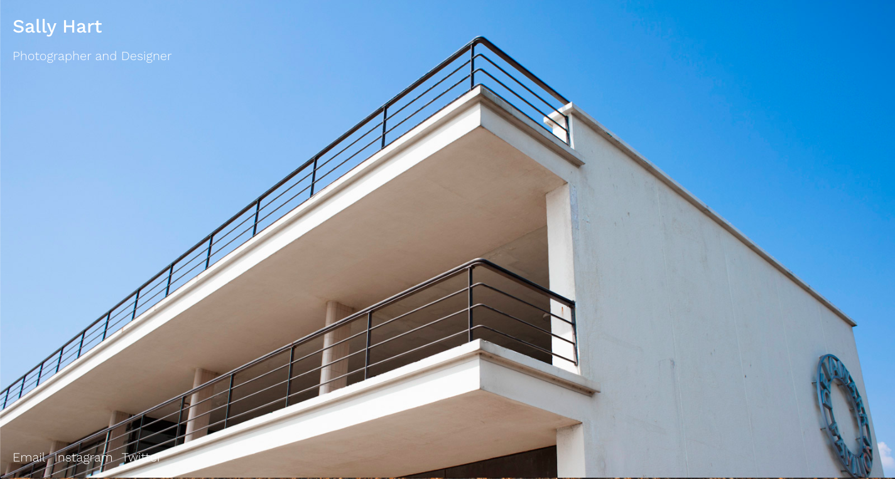

# Sally Hart Portfolio
Portfolio site for Sally Hart Photographer

## Table of contents
* [General info](#general-info)
* [Screenshots](#screenshots)
* [Technologies](#technologies)
* [Demo](#demo)
* [Features](#features)
* [Status](#status)
* [Inspiration](#inspiration)
* [Contact](#contact)

## General info
This was the first project on the [Superhi Foundation](https://superhi.com/courses/html-css-javascript-foundation) course. An introduction to HTML and CSS, this project is a portfolio site featuring large full screen images that reveal as you scroll

## Screenshots

## Technologies
* HTML5
* CSS3

## Demo
[Live Demo](https://guybroadhurst.github.io/sally-hart-portfolio/)

## Code Examples
The effect is acheived by attaching the photos as background-images:
`background-attachment: fixed;`

## Features
List of features:
* As you scroll the photographs reveal themselves with a shutter/parallax effect.
* On mobile sized screens, this effect is disabled.

## Status
Project is: _finished_ and completed for the course.
 
## Contact
Created by [@guybroadhurst](https://www.guybroadhurst.co.uk/) - feel free to contact me!